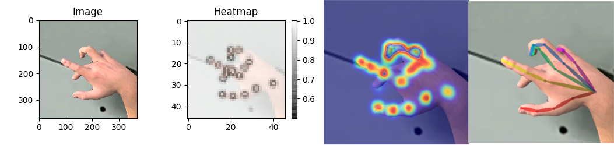

# hand_detector_train

Replicating the Openpose hand detection algorithm, training a similar Convolutional Neural Network using Tensorflow.

Original Openpose Repo(Caffe) : https://github.com/CMU-Perceptual-Computing-Lab/openpose

Read the Medium story explaining this repository on: https://medium.com/@apofeniaco/training-a-hand-detector-like-the-openpose-one-in-tensorflow-45c5177d6679



## Install

### Dependencies

You need dependencies below.

- python3
- tensorflow 1.4.1+
- opencv3, protobuf, python3-tk

### Install

Clone the repo and install 3rd-party libraries.

```bash
$ git clone https://github.com/ortegatron/hand_detector_train.git
$ cd hand_detector_train
$ pip3 install -r requirements.txt
```

Download openpose_vgg16.npy from http://www.mediafire.com/file/7e73ddj31rzw6qq/openpose_vgg16.npy and save into hand_detector_train/models/numpy. The VGG-16 first layers are taken from there to do the feature extraction.

Download the [Hands from Synthetic Data Dataset](http://domedb.perception.cs.cmu.edu/panopticDB/hands/hand_labels_synth.zip), extract somewhere on your disk. We will refer to this folder as $HANDS_SNYTH_PATH.

### Training

To start the training:

```
$ python3 train.py --datapath=$HANDS_SNYTH_PATH

[2019-08-10 03:24:51,727] [train] [INFO] define model-
[2019-08-10 03:24:52,163] [train] [INFO] model weights initialization
[2019-08-10 03:24:54,351] [train] [INFO] Restore pretrained weights... ./models/numpy/openpose_vgg16.npy
[2019-08-10 03:25:02,852] [train] [INFO] Restore pretrained weights...Done
[2019-08-10 03:25:02,853] [train] [INFO] prepare file writer
[2019-08-10 03:25:04,574] [train] [INFO] prepare coordinator
[2019-08-10 03:25:04,577] [train] [INFO] Training Started.
```
This will use the default parameters for the training. Check the ArgumentParser of train.py to see the list of parameters you can change.

While training, the script will give for each 500 steps the following output:

```
[2019-08-10 03:51:07,374] [train] [INFO] epoch=0.53 step=1000, 40.9523 examples/sec lr=0.000100, loss=155.03, loss_ll_heat=30.5468
```
This shows the current epoch and step (each epoch has 121745 / batchsize steps), the processing speed, the learing rate being used, the current loss value, and the loss for the last layer. For each 2000 steps a checkpoint of the model is going to be saved on the models/train/test folder. Training will run until it reaches the max_epoch, by default set to 600. This is a lot, but you can stop the training at any moment just by killing the script.

Once you are happy with the loss value gotten while training, stop it and the last saved checkpoint will be available on models/train/test. Checkpoints are made of three files:
- model_latest-XXXX.meta: The training graph structure is saved here.
- model_latest-XXXX.index: Stores metadata about the tensors
- model_latest-XXXX.data-00000-of-00001: Stores the values of all variables on the network.

You can see more information about the training process runing tensorboard on the log folder. It will show you loss graphs, and the current results on the set of validation images.

```
$ tensorboard --logdir=models/train/test/
```

While it may be tempting to convert those three files into a .pb file and use it, It won't be a good idea, since the saved graph is the training graph, containing the batch tensors, the heatmap tensor for training, etc. We need to generate a fresh graph, containing only the tensors we are going to use on inference time.

#### Freezing the graph

First run:

```
$ python3 run_chekpoint.py
```

This will generate the graph and save it on tmp/graph_definition.pb.

Now we can freeze the graph with the saved checkpoint by doing:

```
$ python3 -m tensorflow.python.tools.freeze_graph \
--input_graph=./tmp/graph_definition.pb \
--input_checkpoint=./models/train/test/model_latest-XXXXX \
--output_graph=./models/frozengraph.pb --output_node_names="Openpose/out"
```
Where model_latest-XXXXX is the name for the saved checkpoint you want to use. This will freeze the graph with the same variable's value as the saved checkpoint, and save it on ./models/frozengraph.pb.

#### Testing the detector

To test the trained detector:

```
$ python3 test.py --graph-path=$GRAPH_PATH --image-path=$IMAGE_PATH
```

It will show the detected belief maps on top of the image.
